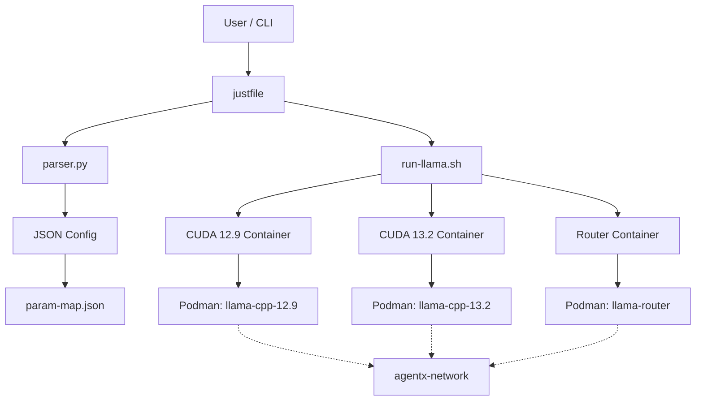
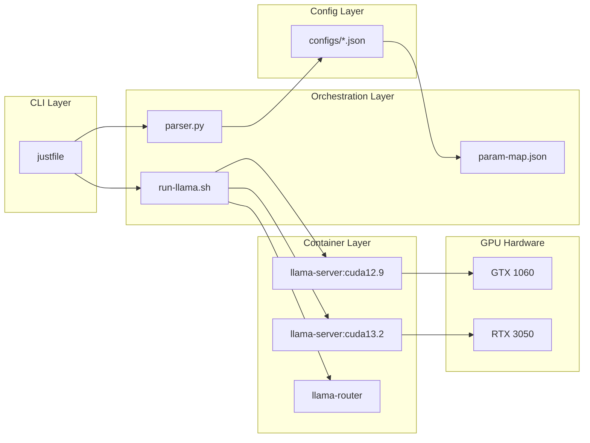

# agentx

**Local LLM Inference Platform** — A unified container-based manager for running [llama.cpp](https://github.com/ggerganov/llama.cpp) servers via Podman, with multi-GPU support, JSON-driven configuration, and a router mode for load-balanced inference.

> **Goal:** Make it trivial to spin up, manage, and scale local LLM inference across heterogeneous GPU setups — all from a single CLI.

---

## Table of Contents

- [Architecture](#architecture)
- [Quick Start](docs/quick-start.md)
- [NVIDIA GPU Setup](docs/nvidia-gpu-setup.md)
- [Usage Guide](docs/usage.md)
- [Configuration](docs/configuration.md)
- [Build Guide](docs/build.md)
- [Router Mode](docs/router.md)
- [Supported Models](#supported-models)
- [Project Structure](#project-structure)
- [Prerequisites](#prerequisites)
- [License](#license)

---

## Architecture

### System Flow



### Architecture Overview



**Key components:**

| Component | Location | Purpose |
|-----------|----------|---------|
| `justfile` | Root | Unified build & container management |
| `containers/run-llama.sh` | `containers/` | Container runner (start/stop/router/status) |
| `containers/parser.py` | `containers/` | JSON config → llama-server CLI argument generator |
| `containers/param-map.json` | `containers/` | Maps config keys to llama-server flags |
| `containers/configs/` | `containers/` | Pre-built model configuration files |
| `containers/images/` | `containers/` | Podman Containerfiles (CUDA 12.9, 13.2) |
| `source-build/scripts/` | `source-build/` | Native build scripts (bash & PowerShell) |
| `source-build/llama.cpp` | `source-build/` | Git submodule for llama.cpp source |

---

## Supported Models

Pre-configured models in `containers/configs/`:

| Config File | Model | CUDA Version | Notes |
|-------------|-------|--------------|-------|
| `qwen-3.6-35B-A3B-coding.json` | Qwen 3.6 35B-A3B (Coding) | 12.9 / 13.2 | MoE, speculative decoding, multimodal |
| `qwen-3.6-35B-A3B-create.json` | Qwen 3.6 35B-A3B (Create) | 12.9 / 13.2 | Creative writing optimized |
| `qwen-3.6-35B-A3B-MTP.json` | Qwen 3.6 35B-A3B (MTP) | 12.9 / 13.2 | Multi-token prediction |
| `gemma-4-12B-IT-QAT.json` | Gemma 4 12B-IT | 12.9 / 13.2 | Instruction-tuned, QAT quantized |
| `gemma-4-E4B-IT-QAT.json` | Gemma 4 E4B-IT | 12.9 / 13.2 | Instruction-tuned, QAT quantized |
| `nemotron-3.5-30B-A3B.json` | Nemotron 3.5 30B-A3B | 12.9 / 13.2 | NVIDIA MoE model |

---

## Project Structure

```
.
├── README.md                  # You are here
├── justfile                   # Build & container management
├── LICENSE
│
├── docs/                      # User guides (modular)
│   ├── quick-start.md         # Step-by-step getting started
│   ├── nvidia-gpu-setup.md    # NVIDIA GPU passthrough guide
│   ├── usage.md               # How to run, manage, and query
│   ├── configuration.md       # JSON config format reference
│   ├── build.md               # Native & container builds
│   └── router.md              # Multi-backend router mode
│
├── containers/                # Podman container management
│   ├── run-llama.sh           # Container runner script
│   ├── parser.py              # Config parser
│   ├── param-map.json         |
│   ├── configs/               |── Model configuration files
│   │   ├── qwen-3.6-35B-A3B-coding.json
│   │   ├── qwen-3.6-35B-A3B-create.json
│   │   ├── qwen-3.6-35B-A3B-MTP.json
│   │   ├── gemma-4-12B-IT-QAT.json
│   │   ├── gemma-4-E4B-IT-QAT.json
│   │   └── nemotron-3.5-30B-A3B.json
│   └── images/                |── Podman Containerfiles
│       ├── cuda-12-9.Containerfile
│       └── cuda-13-2.Containerfile
│
├── source-build/              # Native build from source
│   ├── scripts/               |── build.sh, build.ps1, clean scripts
│   ├── artifacts/             |── Build output directory
│   ├── config/                |── Build configuration
│   └── llama.cpp/             │── Git submodule (llama.cpp source)
│
├── sizes.md                   # Context size options reference
│
└── .prompts/                  # Prompt templates
    ├── coding-harness.txt
    └── systems-engineer.txt
```

---

## Prerequisites

| Requirement | Details |
|-------------|---------|
| **OS** | WSL2 (Ubuntu recommended) or Windows 11 22H2+ |
| **Container runtime** | Podman |
| **GPU drivers** | NVIDIA drivers (Windows 11 22H2+) |
| **CUDA toolkit** | CUDA 12.9 or 13.2 (provided in containers) |
| **Python 3** | For config parsing (`parser.py`) |
| **just** | Build automation tool |
| **$LLAMA_MODELS_PATH** | Environment variable pointing to your GGUF models directory |
| **Podman network** | `agentx-network` (created via `just network_create`) |

### GPU Mapping

| GPU | Compute Capability | CUDA Version | Image Tag | Container Name | Default Port |
|-----|-------------------|--------------|-----------|----------------|--------------|
| GTX 1060 | 6.1 | 12.9 | `llama-server:cuda12.9` | `llama-cpp-12.9` | 9696 |
| RTX 3050 | 8.6 | 13.2 | `llama-server:cuda13.2` | `llama-cpp-13.2` | 9698 |

---

## Quick Start

1. **Set up the network:**
   ```bash
   just network_create
   ```

2. **Build container images:**
   ```bash
   just container_build_all
   ```

3. **Run a model:**
   ```bash
   just run_config --config containers/configs/qwen-3.6-35B-A3B-coding.json
   ```

4. **Check status:**
   ```bash
   just status
   ```

5. **Stop all containers:**
   ```bash
   just stop
   ```

👉 For detailed steps, see [Quick Start Guide](docs/quick-start.md).

---

## License

This project is licensed under the MIT License. See [LICENSE](LICENSE) for details.
